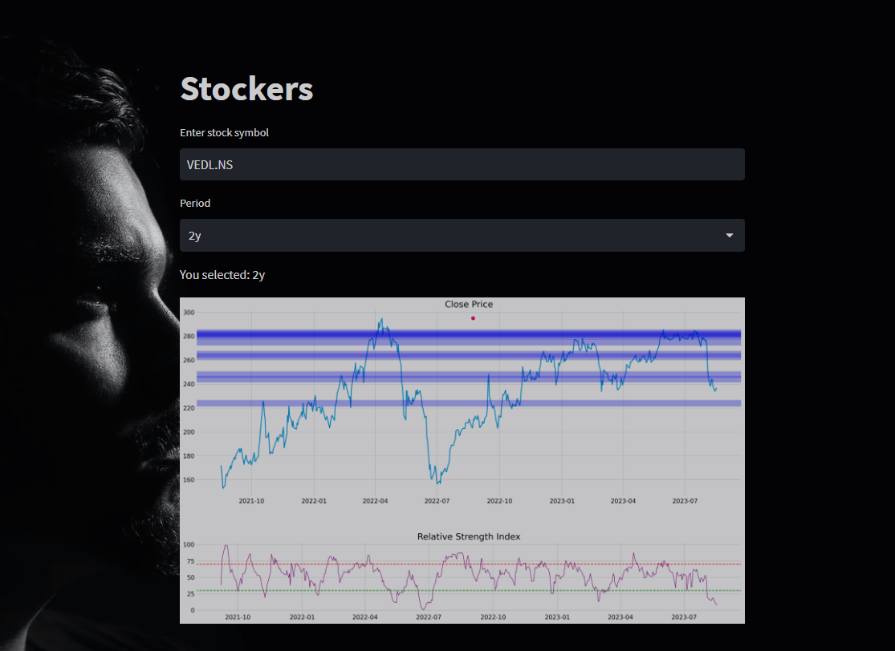

# Stockers 
The code sample fetches historical stock price data for a given ticker symbol using the yfinance library. It then processes this data by adding new features (Year, Month, Day, DayofWeek) and splits it into training and testing sets. A machine learning model (either linear regression or random forest) is trained on the training set to predict stock prices. The model's performance is evaluated using Mean Squared Error (MSE) on the testing set, and a plot is generated to visualize the actual versus predicted stock prices.

A Real-Time Stock Market Data Analyzing Website Using Indicator like Volume and Relative Strength Index.

Empower traders with instant insights for informed decisions.
